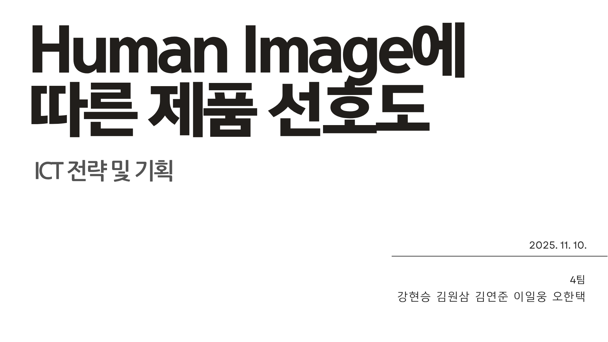
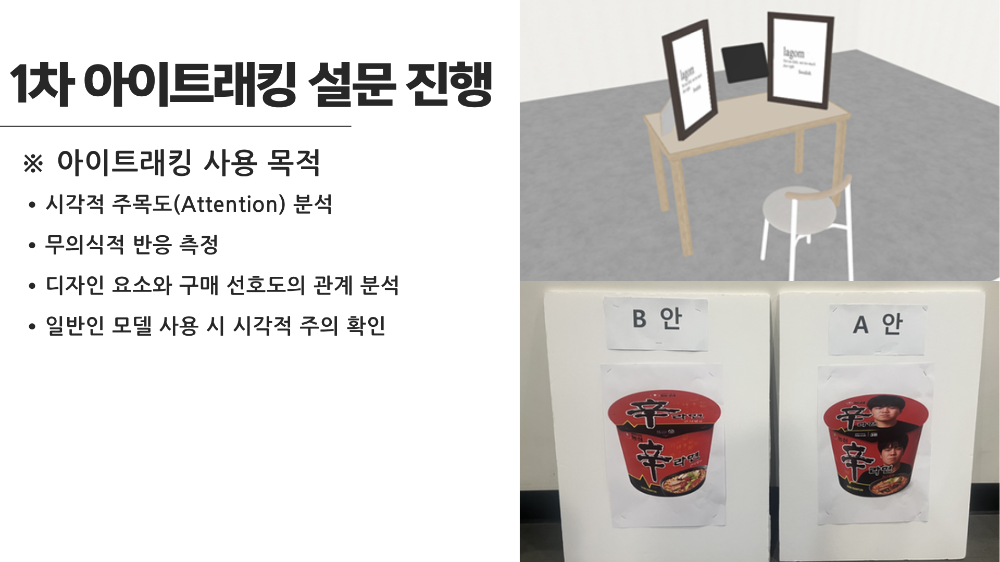
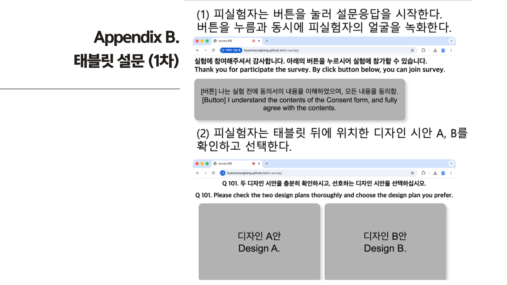
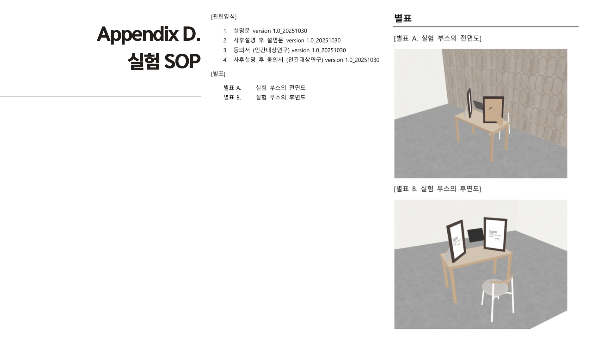
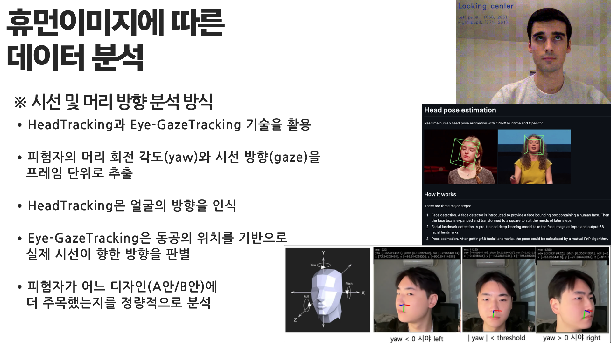
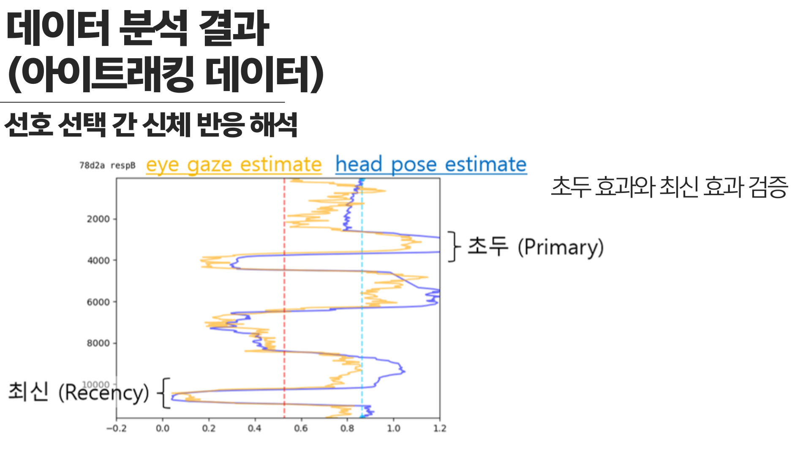
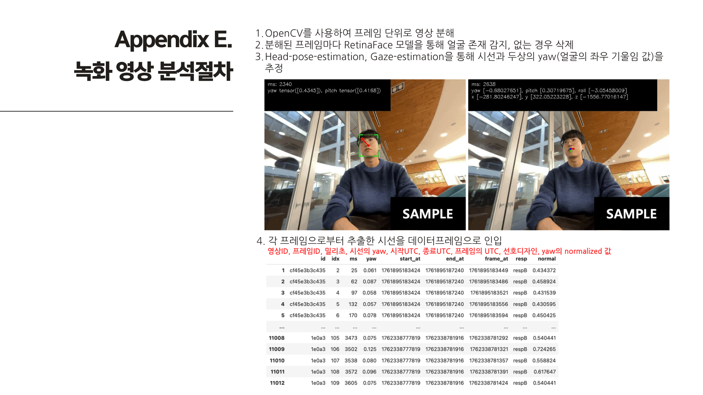
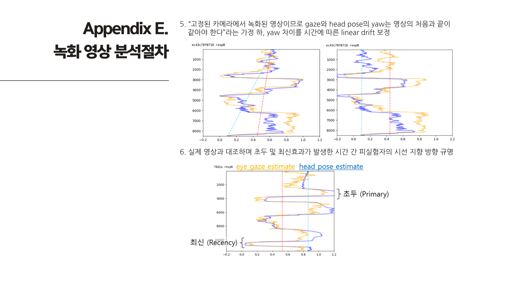

# 휴먼이미지에 따른 데이터 분석 프로젝트

아주대학교 ICT 전략 및 기획 학기 프로젝트

## 목차
1. 시선 추적 실험 설계
2. 시선 추적 실험 결과 분석
3. 시선 추적 녹화 영상 분석 설계
4. Appendix

[결과보고서](images/휴먼이미지에_따른_데이터_분석_프로젝트_결과보고서.pdf)

## 시선 추적 실험 설계

## 시선 추적 실험 결과 분석

## 시선 추적 녹화 영상 분석 설계

## Appendix

[Appendix](docs/)

- 실험절차 SOP
- 동의서: 아주대학교 IRB Consent Form 이용
  - 동의서
  - 설명문
  - 사후설명 후 설명문
  - 사후설명 후 동의서
